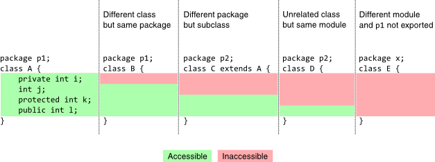

# Java
#### Access modifiers

* A private member (i) is only accessible within the same class as it is declared.
* A member with no access modifier (j) is only accessible within classes in the same package.
* A protected member (k) is accessible within all classes in the same package and within subclasses in other packages.
* A public member (l) is accessible to all classes (unless it resides in a module that does not export the package it is declared in).
### Design Patterns
#### Singleton
* https://www.journaldev.com/1377/java-singleton-design-pattern-best-practices-examples

```java
    class SingletonExample{

    private static SingletonExample INSTANCE = null;

    private SingletonExample() {
        System.out.println("Singleton Created");
    }

    public static SingletonExample getInstance(){
        if(INSTANCE == null){
            return new SingletonExample();
        }
        return INSTANCE;
    }
}
```
    
